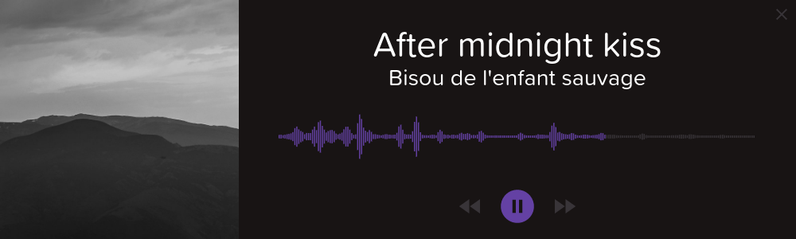

# Barrage

is a minimal-in-design but quite heavy (performance-wise) music player, built on Electron.  

This is an implementation of an audio player design by [AnneMunition](http://annemunition.tv/), a graphic designer and professional Twitch streamer.  (The original After Effects render is sometimes visible in those streams.)  
She has *not* endorsed or approved (or even been made aware) of this application.  (If you've got a line, please ask for forgiveness.)

It uses these additional libraries:
* [math.js](http://mathjs.org/) by Jos de Jong
* [howler.js](https://howlerjs.com/) by GoldFire Studios
* [music-metadata](https://github.com/leetreveil/musicmetadata) by Lee Treveil
* [album-art](https://github.com/lacymorrow/album-art) by Lacy Morrow

Example audio is:  
* After midnight kiss by [Bisou de l'enfant sauvage](https://bisoudelenfantsauvage.bandcamp.com/)

This application is made available under the Creative Commons Attribution-ShareAlike 4.0 license (see LICENSE.md).  Please attribute the application by linking to the GitHub page where it is hosted and with my username, Draekris.

Also,   
This application is not practical.  It's built with Electron, does a huge amount of _stuff_ to show you that nice frequency graph, and you shouldn't use it to play your music library while you work on your netbook.  
It _is_ pretty neat though, in my opinion, and I hope you like it.  

### Installation/use:
A distributable version of this application is not currently provided, though there will be one once all the main features are complete and debugged.  If you would like to try it out and/or help with development, you'll need to install and have a basic understanding of [Node](https://nodejs.org/en/), and preferably Electron and Git as well.

### TODO:  
##### Currently working on:
* Marquee for metadata text
  - (this is half finished in this version)
* Folder drag-and-drop support
  - Ignore non-media files without throwing errors all over the place
* Consolidate options to a config.json 
  - (and perhaps offload reading them to a config.js)
  - Must be completed for dist
* Investigate bug where placing mouse at very right edge of canvas breaks visualization???
  - There are a couple of vis operations that depend on mousePos.
* Debug dataArray.slice (in draw() in vis.js, line ~101)
  - Just disabled for the moment, which is fine.
  - Why does this mutliple-apply, when dataArray is repopulated by analyser.getByteFrequencyData between calls?

##### Needs to happen, but not working on:
* Build, test, and provide distributions
  - Priorities are Win 10, Debian (Ubuntu) Linux, and macOS.
* Metadata problems
  - General polish and testing
  - Doesn't always work, especially with metadata I've edited manually (may be a me problem).
* Improve performance
  - Large file loads 
  - Drag/drop delay (you have to hover for a second or so) - not sure this _can_ be fixed.
  - Visualization, both in terms of processor hit and slight lag
* Resolve window's draggable/resizable problems.
* Support on the fly resizing of the canvas (low priority).
* Fix handling of multi-file drops (only start playing when finished, or prevent new playFromQueue calls while the first file is still playing)

##### Done (mostly):
* (done) Fix audio quality bug
* (done) Fix need to double press play (pause) button
* (done) Add Scrubbing (range slider over top of canvas)
* (done) Improve visualization (noise reduction, ~~highlight time deltas~~)
* (done) Bump at mouse (in vis) (mediocre)
* (done) Multi-file drop support
* (done) Original build  

~~Strikethrough~~ = neither done nor planned

### Possible Features:
* Pull audio from some API (soundcloud, youtube, spotify premium, etc.)
* Integration with Pandora's Box (this is a note to self, I haven't published work on that yet)
* Web version
* Rewrite in something lighter
* Hold last visualization when audio not playing
  - Also, show vis after scrubbing
  - (This is extremely buggy/not intended api usage, so I've abandoned it for now.)

### Notes:
* I'm by no means a JavaScript expert 
  - (let alone Electron/Node/etc. - this is my first time using Node)
  - This was built right on top of electron-quick-start, so it probably includes an _enormous_ amount of unnecessary stuff.
  - If you have improvements or even just suggestions, please let me know or submit a pull request.
  - Speaking of pull requests, I have no experience with them (I've only ever used Git with very trusted teams), so if you're going to contribute via this repository, also send help lol.
* This spectrum visualization is doing a whole bunch of math and drawing a whole bunch of stuff to the canvas, and it's in JavaScript (which isn't super fast), and I haven't really optimized it at all yet.  There's a pretty significant performance impact.
* There's no support for loading files beyond "drag-and-drop."  Half because I'm lazy, half because I didn't want to add any additional UI elements.  I dunno.
* The application can be dragged around by the "title bar" (the region to the left of the close button).  
  For the reason it can't be dragged from everywhere, see Known Issues.
* Please, no dox.

### Known Issues:
* **Critical**
  - None at the moment!
* **Important**
  - Drag-and-drop doesn't always work.
    - Dunno.
* **Non-critical**
  - Resize/drag imperfections
    - The window cannot be resized from the right half of the top edge.  This is because Electron disables resizing for edges which are "draggable."
    - This is also the reason that the entire application is not draggable (if it was, you wouldn't be able to resize it).  I'll work on a layout hack to resolve these issues. 
  - Large/long files take a looong time to load (I tried a 35MB podcast - it took like 15 seconds and froze my computer while loading...)  I suppose this is because it's sticking the whole decompressed thing into memory.  Dunno.
  - Spectrum visualization isn't perfect.
    - Probably a combination of After Effects having better programmers and the opportunity to work at its leisure on the file as a whole, without regard to real time performance.
    - Feel free to provide improvements or suggestions, though keep performance impact in mind.
  - Colors are inaccurate and generally washed out.  This is because I was working from a grainy screenshot at first and then the compressed stream at best.  I'll try to improve these over time, or maybe Anne would drop a couple of files for us to use.
  - Icons are meh/inaccurate, especially the default album image.  I'm using Google's free material design icons.  If there's something better it can be dropped in, but otherwise this is fine.
